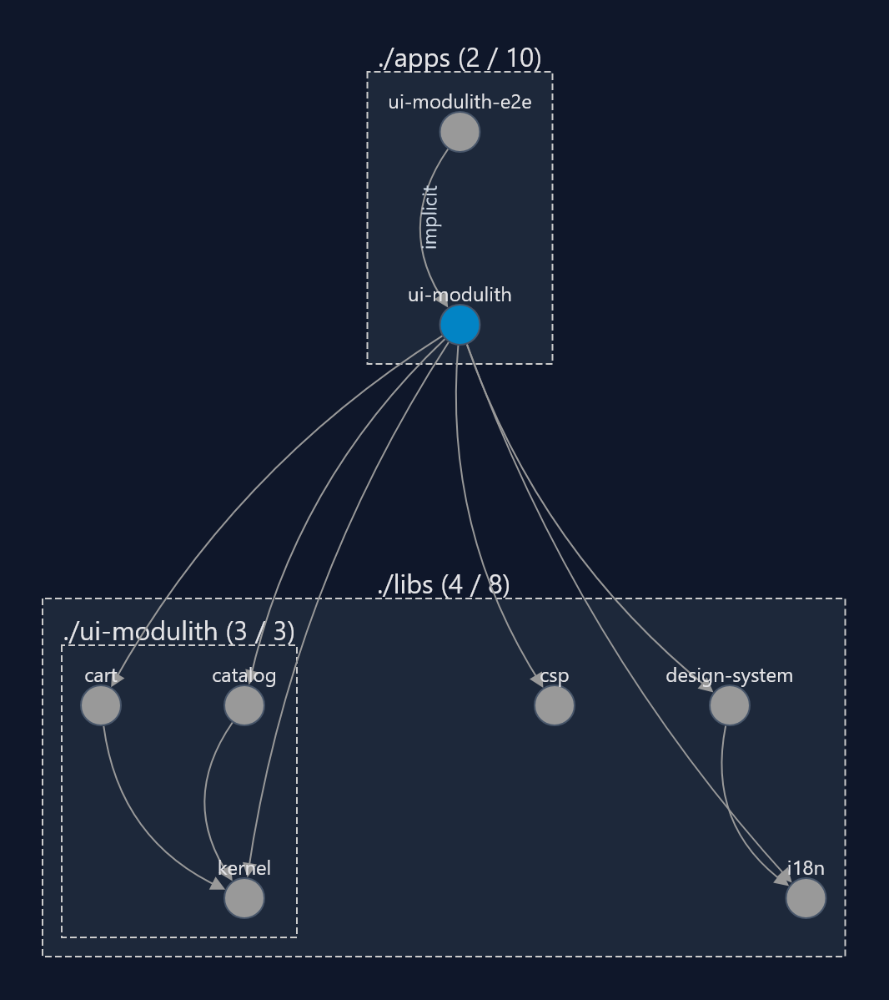

# ui-modulith — Frontend Modulith Lab

A `/labs` demo showing how to get the wins of microfrontends (team autonomy, clear
module boundaries, per-domain code-splitting) and backend moduliths (single build,
single deploy, one shared dependency graph) **without** their costs — no runtime
federation, no microfrontends. Boundaries are enforced by Nx tags at lint time, so a
forbidden import fails the build instead of relying on convention.

## Projects

| Project                  | Tags                             | May depend on                                 |
| ------------------------ | -------------------------------- | --------------------------------------------- |
| `ui-modulith` (this app) | `type:shell`                     | `type:feature`, `type:kernel`, `scope:shared` |
| `catalog`                | `type:feature`, `domain:catalog` | `type:kernel`, `scope:shared`                 |
| `cart`                   | `type:feature`, `domain:cart`    | `type:kernel`, `scope:shared`                 |
| `kernel`                 | `type:kernel`                    | `scope:shared`                                |

`catalog` and `cart` never import each other — they communicate only through the
kernel's typed `EventBus` (`cart/add`). See `libs/ui-modulith/kernel/src/bus/`.

Generated with `nx graph --focus=ui-modulith`.

## Deploy

Static build, served under `/labs/ui-modulith/` via the shared CloudFront distribution
(see `infra/homepage/hosting.ts` / `static-site.ts`) — same pattern as the Todo app, a
dedicated S3 bucket behind the same distribution. No real backend: the OpenAPI-mocked
API (MSW) is the permanent "backend" for this demo in every environment, including
production (see `src/main.tsx`).

The homepage's `/labs` card linking here is gated behind the `labs-modulith` feature
flag (`apps/homepage/public/flags.json`), shipped `DISABLED` by default.
